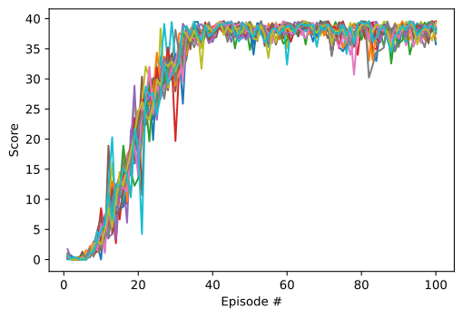
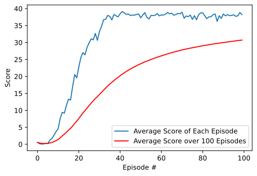

# Report
---
This project utilized the coding example for OpenAI Gym's Pendulum environment using DDPG (Deep Deterministic Policy Gradient) algorithm, as outlined in the Udacity repo [`ddpg-pendulum`](https://github.com/udacity/deep-reinforcement-learning/tree/master/ddpg-pendulum). I modified acordingly to solve the [Reacher](https://github.com/Unity-Technologies/ml-agents/blob/master/docs/Learning-Environment-Examples.md#reacher) environment.

In the Reacher environment, a double-jointed arm can move to target locations. A reward of +0.1 is provided for each step that the agent's hand is in the goal location. Thus, the goal of your agent is to maintain its position at the target location for as many time steps as possible.

The observation space consists of 33 variables corresponding to position, rotation, velocity, and angular velocities of the arm. Each action is a vector with four numbers, corresponding to torque applicable to two joints. Every entry in the action vector should be a number between -1 and 1.

The environment I use contains 20 identical agents, each with its own copy of the environment. The environment is considered solved, when the average scores(over 100 episodes and all 20 agents) is at least +30. 

# Learning algorithm

The action vector in the Reacher environment lies in continue space, therefore the value-based algorithms such as DQN are not suitable for solving this environment. 
Deep Deterministic Policy Gradient (DDPG) is a combination of Q-learning and Policy gradients, which can be thought of as being deep Q-learning for continuous action spaces.

DDPG is a kind of Actor-critic method which can leverage the strengths of both policy-based and value-based methods. Actor-critic methods consist of two models:
- The Critic updates the value function parameters.
- The Actor updates the policy parameters in the direction suggested by the Critic.

The implementation of ddpg_agent is contained in [`ddpg_agent.py`](ddpg_agent.py). 

### Hyper Parameters using in ddpg_agent.py

- BUFFER_SIZE (int): replay buffer size
  - `BUFFER_SIZE = int(1e6)`
- BATCH_SIZ (int): minibatch size
  - `BATCH_SIZE = 256`
- GAMMA (float): discount factor
  - `GAMMA = 0.99`
- TAU (float): for soft update of target parameters
  - `TAU = 1e-3`
- LR_ACTOR (float): learning rate of the actor
  - `LR_ACTOR = 1e-4`
- LR_CRITIC (float): learning rate of the critic
  - `LR_CRITIC = 3e-4`
- LEARN_EVERY (int): learning timestep interval
  - `LEARN_EVERY = 10`
- LEARN_NUM (int): number of learning passes
  - `LEARN_NUM = 20`

The buffer size and batch size is suitable for the machine with large memory such as 32GB which is used in my machine. 
GAMMA should be large value near 1 and TAU should be small value. 
Learning rate of the actor and critic are set by trial and error.
LEARN_EVERY and LEARN_NUM are also set by trial and error, and also make the system learn faster. 

### Neural network model architecture
The [Actor and Critic networks](model.py) are defined for DDPG algorithm.

- Actor network
  - 2 fully connected layers, both layers are 512 units
  - Fully connected layers activate with relu
  - Output layer for action space activate with tanh

- Critic network
  - 2 fully connected layers, both layers are 512 units
  - Fully connected layers activate with leaky_relu


### Other Hyper Parameters of DDPG

- n_episodes (int): maximum number of training episodes
  - `n_episodes=200` 
- max_t (int): maximum number of timesteps per episode
  - `max_t=1000`

the maximum number episodes is set to relatively larger numbers in order to avoid early stopping, and the maximum of timesteps larger than 1000 is meaningless because the environment will always return `done` when `t` reaches 1000. 


# Plot of Rewards
The scores of all agents:


The average score of each episode and over 100 Episodes:


```
Mean Score in Episode 097: 37.73, 	Mean Score over last 100 episodes: 30.49 (29.8 secs)
Mean Score in Episode 098: 37.88, 	Mean Score over last 100 episodes: 30.57 (30.2 secs)
Mean Score in Episode 099: 38.86, 	Mean Score over last 100 episodes: 30.65 (30.5 secs)
Mean Score in Episode 100: 38.21, 	Mean Score over last 100 episodes: 30.73 (31.0 secs)
Episode 100	Average Score over last 100 episodes: 30.73
```

# Ideas for Future Work

Tuning the hyper parameters in DDPG algorithm requires much efforts of trial and error. Sometimes the algorithm is totally not working or quite unstable.

Proximal Policy Optimization (PPO) algorithm is a good candidate to explore as it could more stable learning with Trust Region Policy Optimization

Distributed Distributional Deterministic Policy Gradients (D4PG) algorithm could be another candidate to try as it should be more robust and may reach the goal faster.


